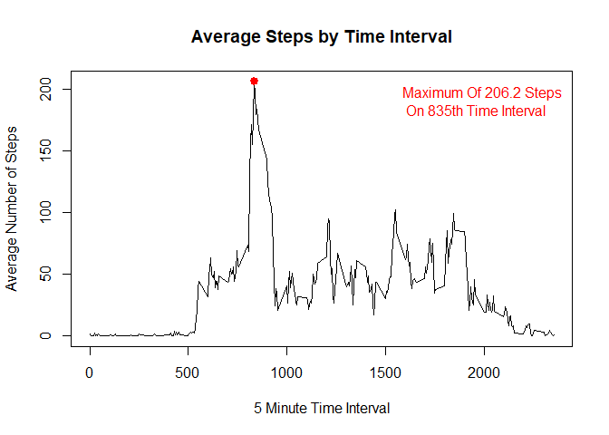
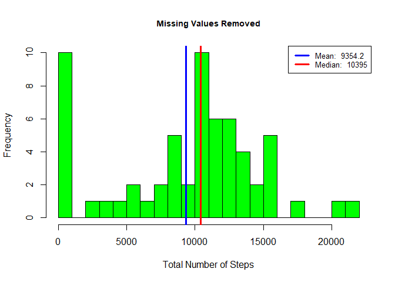
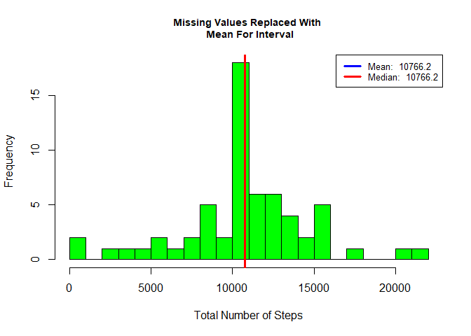
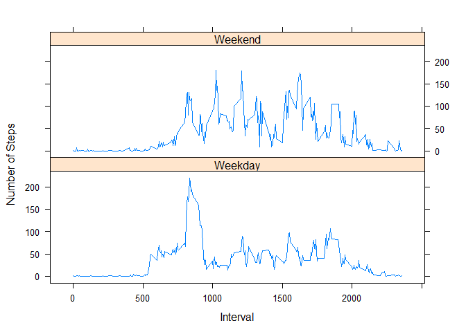

## Introduction
It is now possible to collect a large amount of data about personal movement 
using activity monitoring devices such as a Fitbit, Nike Fuelband, or Jawbone Up. 
These type of devices are part of the "quantified self" movement - a group of 
enthusiasts who take measurements about themselves regularly to improve their 
health, to find patterns in their behavior, or because they are tech geeks. 
But these data remain under-utilized both because the raw data are hard to obtain 
and there is a lack of statistical methods and software for processing and 
interpreting the data.

This assignment makes use of data from a personal activity monitoring device. 
This device collects data at 5 minute intervals through out the day. 
The data consists of two months of data from an anonymous individual collected 
during the months of October and November, 2012 and include the number of steps 
taken in 5 minute intervals each day.

## Librarys

```r
library(data.table)
library(ggplot2)
```

```
## Warning: package 'ggplot2' was built under R version 3.5.3
```

```r
library(lattice)
```

```
## Warning: package 'lattice' was built under R version 3.5.3
```

## Loading and preprocessing the data

Unzip data to obtain a csv.

```r
unzip("activity.zip",exdir = "data")
```

## Reading Data into Data.Table. 

```r
dat = read.csv('data/activity.csv', header = TRUE)
```

## Knowing de Data

```r
names(dat)
```

```
## [1] "steps"    "date"     "interval"
```

```r
dim(dat)
```

```
## [1] 17568     3
```

```r
head(dat)
```

```
##   steps       date interval
## 1    NA 2012-10-01        0
## 2    NA 2012-10-01        5
## 3    NA 2012-10-01       10
## 4    NA 2012-10-01       15
## 5    NA 2012-10-01       20
## 6    NA 2012-10-01       25
```

```r
str(dat)
```

```
## 'data.frame':	17568 obs. of  3 variables:
##  $ steps   : int  NA NA NA NA NA NA NA NA NA NA ...
##  $ date    : Factor w/ 61 levels "2012-10-01","2012-10-02",..: 1 1 1 1 1 1 1 1 1 1 ...
##  $ interval: int  0 5 10 15 20 25 30 35 40 45 ...
```

```r
summary(dat)
```

```
##      steps                date          interval     
##  Min.   :  0.00   2012-10-01:  288   Min.   :   0.0  
##  1st Qu.:  0.00   2012-10-02:  288   1st Qu.: 588.8  
##  Median :  0.00   2012-10-03:  288   Median :1177.5  
##  Mean   : 37.38   2012-10-04:  288   Mean   :1177.5  
##  3rd Qu.: 12.00   2012-10-05:  288   3rd Qu.:1766.2  
##  Max.   :806.00   2012-10-06:  288   Max.   :2355.0  
##  NA's   :2304     (Other)   :15840
```

## What is mean total number of steps taken per day?*
### Histogram of the total number of steps taken each day
### Mean and median number of steps taken each day

```r
dat_tbl = data.table(dat)
dat_tbl_summary = dat_tbl[, list(total_steps = sum(steps, na.rm = T)), by = date]
```

**Note: Mean and Median Are Reported In Legend Of Histogram**


```r
#Making The Generation of This Plot Into A Function So I Can Re-use Later
gen_hist = function(x, title){
        hist(x, 
             breaks = 20,
             main = title,
             xlab = 'Total Number of Steps', col = 'green',
             cex.main = .9)
        
        #mean and median
        mean_value = round(mean(x), 1)
        median_value = round(median(x), 1)
        
        #place lines for mean and median on histogram
        abline(v=mean_value, lwd = 3, col = 'blue')
        abline(v=median_value, lwd = 3, col = 'red')
        
        #create legend
        legend('topright', lty = 1, lwd = 3, col = c("blue", "red"),
               cex = .8, 
               legend = c(paste('Mean: ', mean_value),
               paste('Median: ', median_value))
               )
}
gen_hist(dat_tbl_summary$total_steps, 'Number of Steps Taken Per Day')
```

<!-- -->

## What is the average daily activity pattern?*
### Time series plot of the average number of steps taken

```r
#summarize dataset by interval
dat_tbl_summary_intv = dat_tbl[, list(avg_steps = mean(steps, na.rm = T)), by = interval]

#plot the time series
with(dat_tbl_summary_intv, {
        plot(interval, avg_steps, type = 'l',
             main = 'Average Steps by Time Interval',
             xlab = '5 Minute Time Interval',
             ylab = 'Average Number of Steps')
        })

### The 5-minute interval that, on average, contains the maximum number of steps
max_steps = dat_tbl_summary_intv[which.max(avg_steps), ]
max_lab = paste('Maximum Of ', round(max_steps$avg_steps, 1), ' Steps \n On ', max_steps$interval, 'th Time Interval', sep = '')
points(max_steps$interval,  max_steps$avg_steps, col = 'red', lwd = 3, pch = 19)
legend("topright", legend = max_lab, text.col = 'red', bty = 'n')
```

<!-- -->

## Imputing missing values*

```r
sum(is.na(dat$steps))
```

```
## [1] 2304
```

### Creating new data file

```r
setkey(dat_tbl, interval)
setkey(dat_tbl_summary_intv, interval)


#Create function that will return the second value if the first value is NA
NA_replace = function(x,y){
        if(is.na(x)){
                
                return(y)
        }
        return(x)
}

#create new dataset that replaces NAs with average values
dat_tbl_miss = dat_tbl[dat_tbl_summary_intv]
dat_tbl_miss$new_steps = mapply(NA_replace,dat_tbl_miss$steps, dat_tbl_miss$avg_steps)

#summaryize new dataset by day
dat_tbl_summary_miss = dat_tbl_miss[, list(new_steps = sum(new_steps, na.rm = T)), 
                          by = date]
#preview new dataset
head(dat_tbl_summary_miss)
```

```
##          date new_steps
## 1: 2012-10-01  10766.19
## 2: 2012-10-02    126.00
## 3: 2012-10-03  11352.00
## 4: 2012-10-04  12116.00
## 5: 2012-10-05  13294.00
## 6: 2012-10-06  15420.00
```
**Note: Mean and Median Are Reported In Legend Of Histogram**


```r
gen_hist(dat_tbl_summary$total_steps, 'Missing Values Removed')
```

<!-- -->

```r
gen_hist(dat_tbl_summary_miss$new_steps, 'Missing Values Replaced With \n Mean For Interval')
```

<!-- -->

## Are there differences in activity patterns between weekdays and weekends?*


```r
#Make Function To Return Either "Weekday" or "Weekend"
weekpart = function(x){
        if(x %in% c('s攼㸱bado', 'domingo')){
                return('Weekend')
        }
        
        return('Weekday')
}
#Add Name of Week
dat_tbl_miss$dayname = weekdays(as.Date(dat_tbl_miss$date))

#Add Factor Variable To Differentiate Weekday and Weekend
dat_tbl_miss$daytype = as.factor(apply(as.matrix(dat_tbl_miss$dayname), 1, weekpart))
#Summarize Dataset: Mean grouped by interval and daytype
dat_tbl_summary_miss = dat_tbl_miss[, list(avg_steps = mean(new_steps, na.rm = T)), 
                          by = list(interval, daytype)]
#inspect dataset
str(dat_tbl_summary_miss)
```

```
## Classes 'data.table' and 'data.frame':	576 obs. of  3 variables:
##  $ interval : int  0 0 5 5 10 10 15 15 20 20 ...
##  $ daytype  : Factor w/ 2 levels "Weekday","Weekend": 1 2 1 2 1 2 1 2 1 2 ...
##  $ avg_steps: num  1.9438 0.2146 0.3845 0.0425 0.1495 ...
##  - attr(*, ".internal.selfref")=<externalptr>
```

Below is the panel plot:

```r
xyplot(avg_steps~interval | daytype, data = dat_tbl_summary_miss,
      type = 'l',
      xlab = 'Interval',
      ylab = 'Number of Steps',
      layout = c(1,2))
```

<!-- -->
